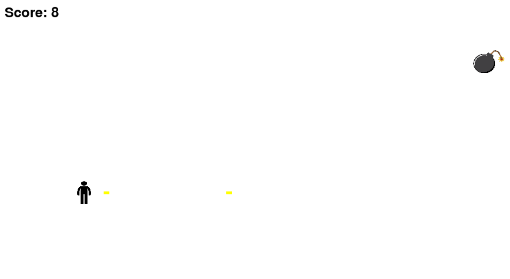

I added a scoreboard, and changed the sprites to ones I preferred.
It was a little difficult to set up the score, but some stack overflow articles were enough for me to overcome the problems i ran into.

