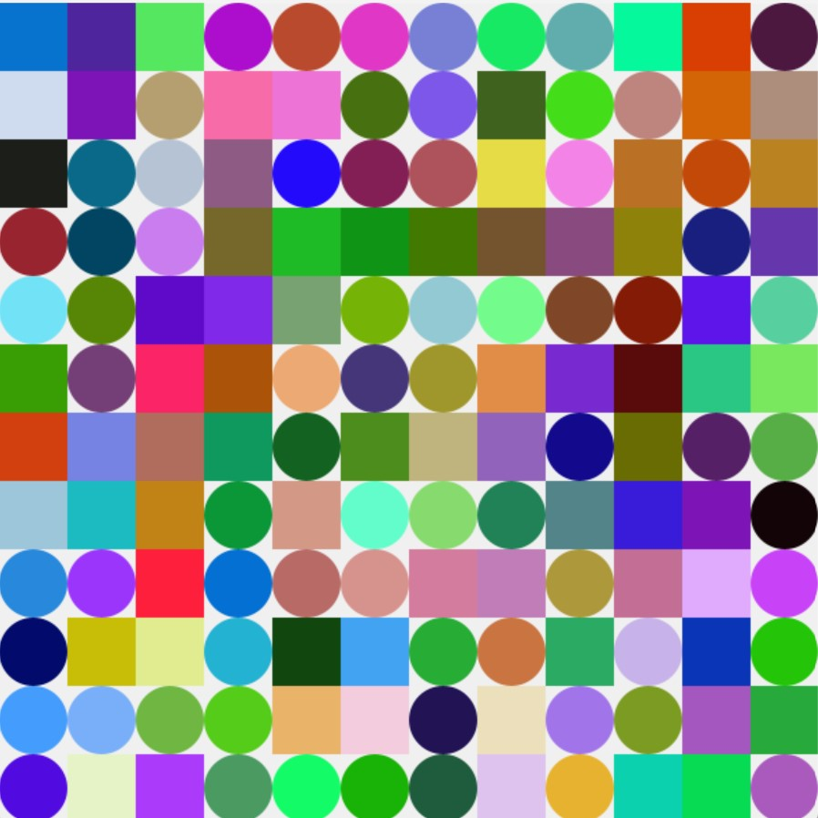

# Description

This artwork is a generative composition of repeating squares and circles arranged in a grid. The colors of the shapes are randomized, creating a vibrant and dynamic pattern. The sketch is interactive—clicking the mouse generates a new arrangement of shapes and colors, making each iteration unique. The use of randomness and interactivity encourages exploration and experimentation, aligning with the creative spirit of the prompt.

## Reference Image

## Sketch Images
   
