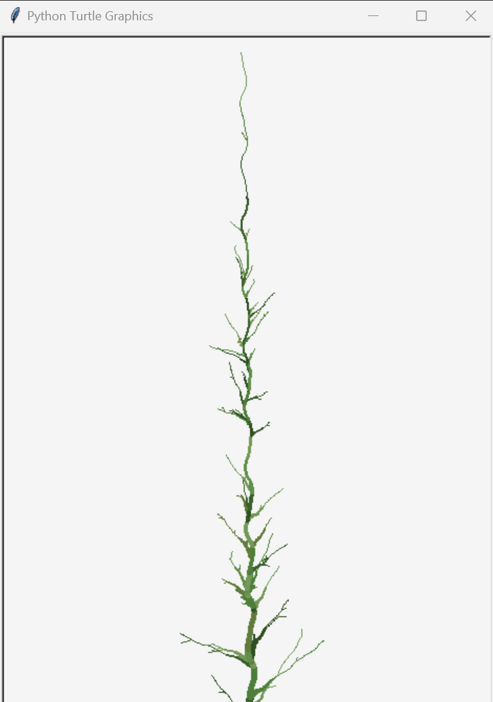
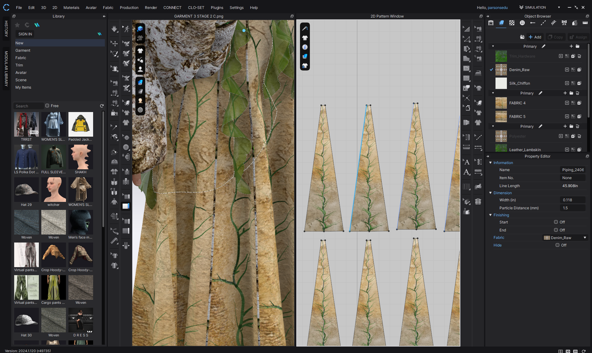
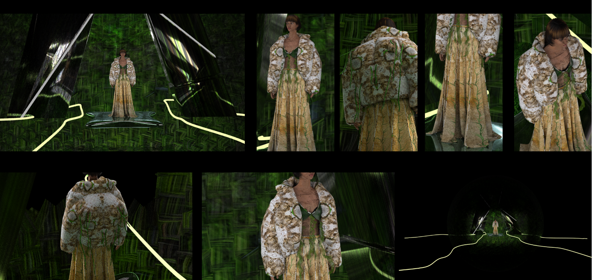
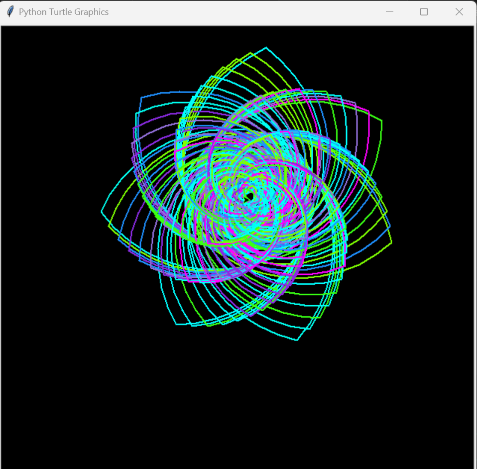
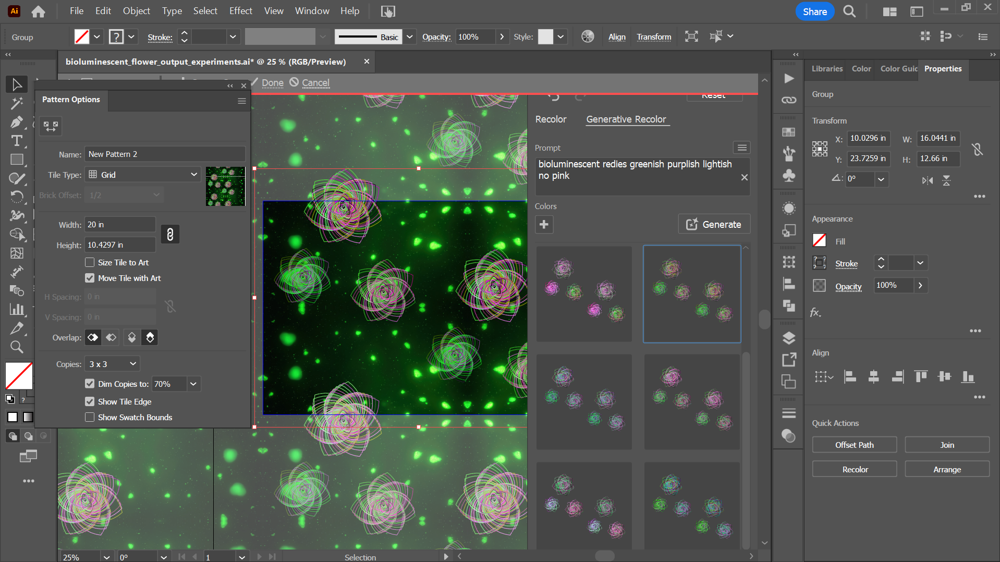
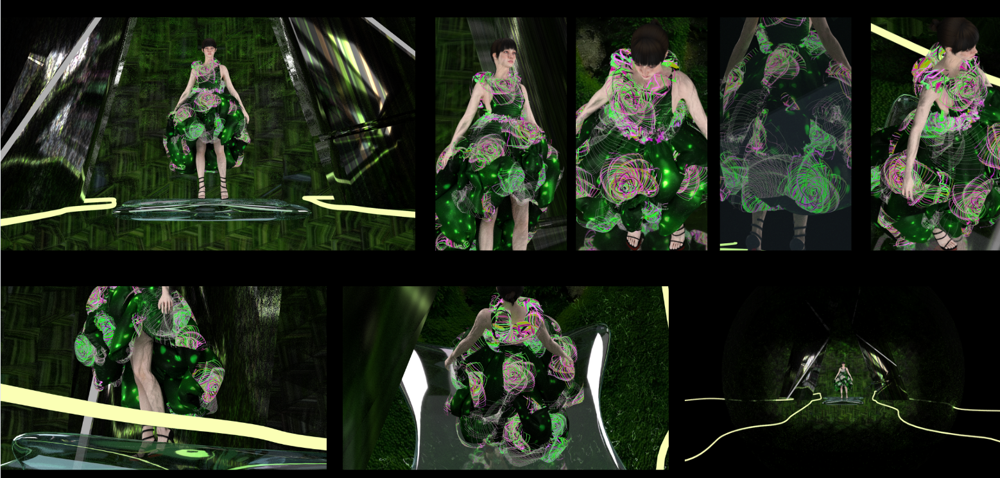

#  After Us, The Wild- Generative Textile Prints with Turtle Python

### Concept
This project explores the use of generative coding with Python's Turtle library to create motifs for a speculative fashion collection titled “After Us, the Wild.” The collection imagines a post-human landscape where nature reclaims industrial ruin. Inspired by biophilic patterns, pendulum art, and concrete overgrowth, the generative visuals reflect decay, regrowth, and blooming ecosystems.

### Why Turtle + Textiles?
* Accessible generative tool for visual pattern creation
* Exported as .eps files → opened in Adobe Illustrator for vector editing
* Integrated into 3D garments in CLO3D as surface prints

 ### Tools Used
* Python Turtle for generative art
* .eps export via Canvas.postscript()
* Adobe Illustrator for refinement + tiling
* CLO3D for final garment visualization

### All scripts include:

Generative drawing using loops, symmetry, and randomness

Export to EPS via:

ts = turtle.getcanvas()
ts.postscript(file="filename.eps")

### 1. Industrial Collapse
* Geometric debris-like repetition
* Abstract rectangles with muted earth tones
* Represents structural decay of urban environments

This piece visualizes the **ruins of a crumbling city**, made from glitched rectangles and scattered debris. It captures the sense of **man-made structures breaking down** over time.

### How the code works:

#### `decayed_rect(w, h, decay)`
- Draws one rectangle at a time, but with **imperfect lines**.
- The rectangle’s sides are broken up into tiny segments.
- Depending on the “decay” level, some parts are:
  - Skipped or lifted mid-line  
  - Drawn with jagged marks  
  - Drawn with different line weights  
- This simulates damage — like **cracks, erosion, and rust**.

#### `scattered_shapes()`
- Places **20+ rectangles randomly** around the canvas.
- Each rectangle has a **random size, angle, and decay level**.
- They overlap and collide, creating the feeling of **collapsed structures or tiles**.

#### `debris()`
- Adds **small, scattered strokes** across the screen.
- Looks like **dust, rubble, or fragmented metal**, adding gritty texture.

### Export:
- The final drawing is saved as an `.eps` and `.png` file using `PIL`,  
  so I can edit it further in Illustrator and turn it into a **textile pattern**.

   
- [CODE LINK](https://www.notion.so/Industrial-Decay-1f1be63be7fd807c85d1c9bdfcec2d29?pvs=4)

### 2. Nature Creeps In
* Growing curves and branching lines
* Inspired by vines, moss, and fungi creeping over stone
* Blends angular forms with organic motion

This piece shows a **vine or plant stem slowly growing**, curving and branching in real time — a symbol of **nature starting to reclaim ruined spaces**.

### How the code works:

#### Main growth loop:
- The Turtle moves **upward one pixel at a time**, drawing a long, slow-growing stem.
- It **wiggles slightly left and right** using sine waves, making the growth feel natural and alive — not stiff.
- The stem gets **thinner as it rises**, just like a real vine.
- Every few frames, the **green color shifts** to mimic light, shadow, and variation.

#### Branching logic (inside the loop):
- Sometimes, the vine randomly creates a **branch at an angle**.
- These branches also **curve and wiggle**, and some even sprout **tiny twigs** at the ends.
- The logic is based on **chance**, so every vine turns out a little different.

### Export:
- Once the full form is drawn, it’s saved as an `.eps` file for further editing in **Illustrator**  
  and used in **garment print layouts**.

     

- [CODE LINK](https://www.notion.so/Nature-Creeping-In-1f1be63be7fd80979db7d6592cfa2657?pvs=4)

### 3. Bioluminescent Bloom
* Glowing petal-like shapes using looping patterns
* Ombre palette of blues, greens, and purples
* Evokes flowers blooming under moonlight or post-toxic adaptation

This piece is a spiraling flower-like form with glowing colors, inspired by bioluminescent plants that might exist in a post-human world.

### How the code works:

Main drawing loop:

The Turtle draws a shape using two mirrored arcs, then rotates slightly and repeats this 180 times.

Each repetition is drawn with a random color from a neon palette: mostly greens, blues, and purples, with just a touch of pink for contrast.

The result is a glowing, layered flower that looks alive and futuristic.

for i in range(180):

    pencolor(random.choice(neon_colors))
    circle(190 - i, 90)
    left(60)
    circle(190 - i, 90)
    left(18)
Export:
Like the others, this is exported as an .eps file for use in Illustrator, where I refined it into a textile print.

    
- [CODE LINK](https://www.notion.so/Bioluminescent-Reclaim-1f1be63be7fd801cb521e2c00d86ed10?pvs=4)

### Reflections
* Learned how generative systems can be used creatively for fashion applications
* Turtle’s simplicity enabled fast experimentation, though scaling patterns for textile use required vector editing
* Bridged computational aesthetics with speculative design
