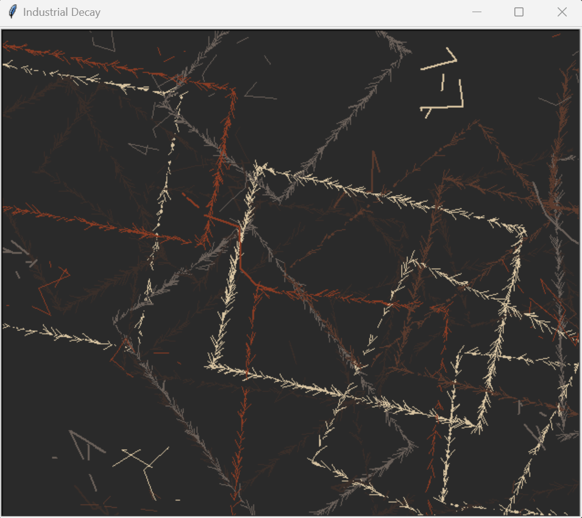
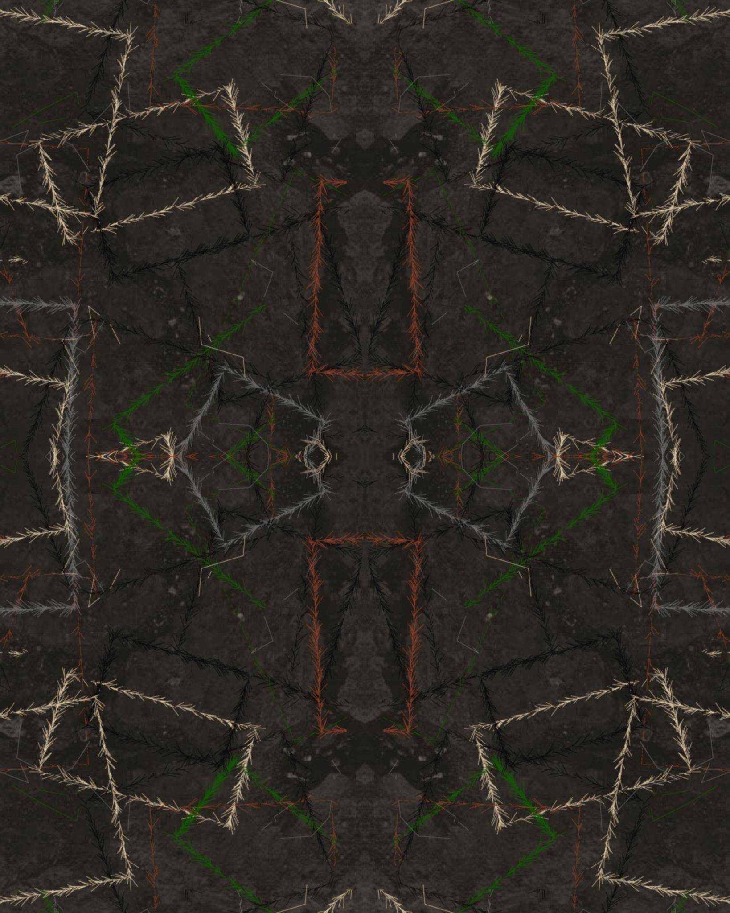
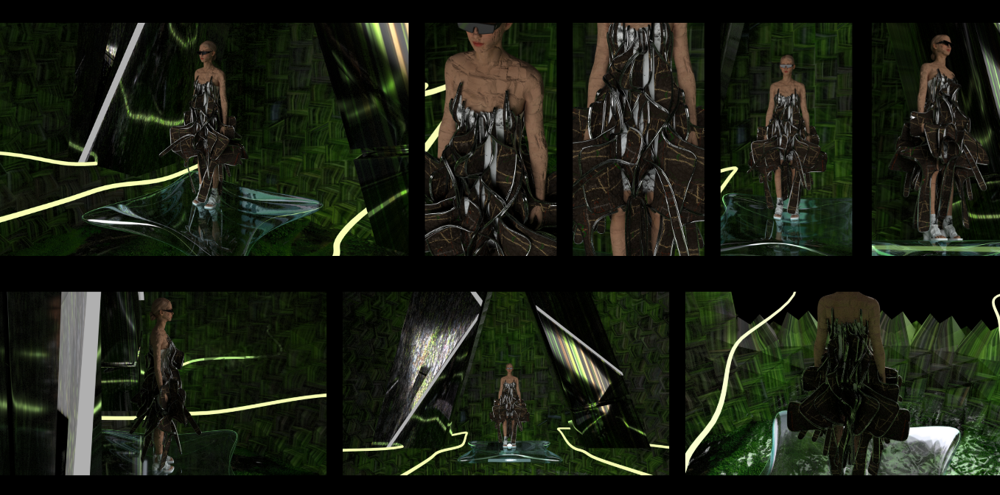

# 🌿 After Us, The Wild- Generative Textile Prints with Turtle Python

### Concept
This project explores the use of generative coding with Python's Turtle library to create motifs for a speculative fashion collection titled “After Us, the Wild.” The collection imagines a post-human landscape where nature reclaims industrial ruin. Inspired by biophilic patterns, pendulum art, and concrete overgrowth, the generative visuals reflect decay, regrowth, and blooming ecosystems.

### Why Turtle + Textiles?
* Accessible generative tool for visual pattern creation
* Exported as .eps files → opened in Adobe Illustrator for vector editing
* Integrated into 3D garments in CLO3D as surface prints

 ### Tools Used
* Python Turtle for generative art
* .eps export via Canvas.postscript()
* Adobe Illustrator for refinement + tiling
* CLO3D for final garment visualization

### 1. Industrial Collapse
* Geometric debris-like repetition
* Abstract rectangles with muted earth tones
* Represents structural decay of urban environments

 -  
- [CODE LINK](https://www.notion.so/Industrial-Decay-1f1be63be7fd807c85d1c9bdfcec2d29?pvs=4)

### 2. Nature Creeps In
* Growing curves and branching lines
* Inspired by vines, moss, and fungi creeping over stone
* Blends angular forms with organic motion
