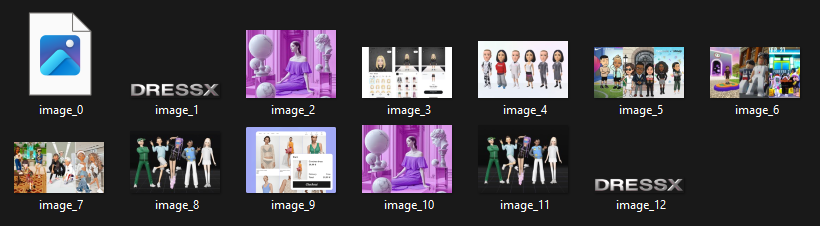

I wanted to scrape images about some kind of latest development where there is a bridge between tech and fashion, and I found this article: https://dressx.com/news/ai-avatar-customization-helps-businesses-stay-ahead-in-virtual-ecosystems

I then used the selenium documentation (for python) linked to us to set up a selenium driver. It took me a while, but I managed to set up a driver that could access elements on the article using just informations I learned and got from the docs.
However I was having problems writing these images onto my computer so I could screenshot them, so I searched this up and found the following stackoverflow discussion that helped me:
https://stackoverflow.com/questions/30229231/python-save-image-from-url

I was then able to scrape and save the images i found on the article.

